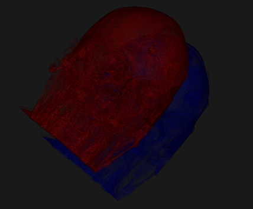
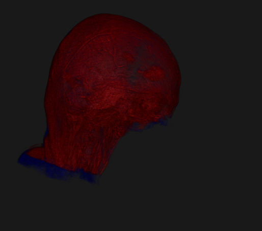
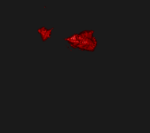
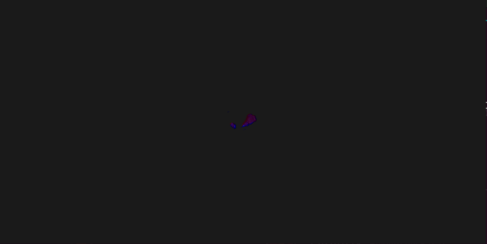
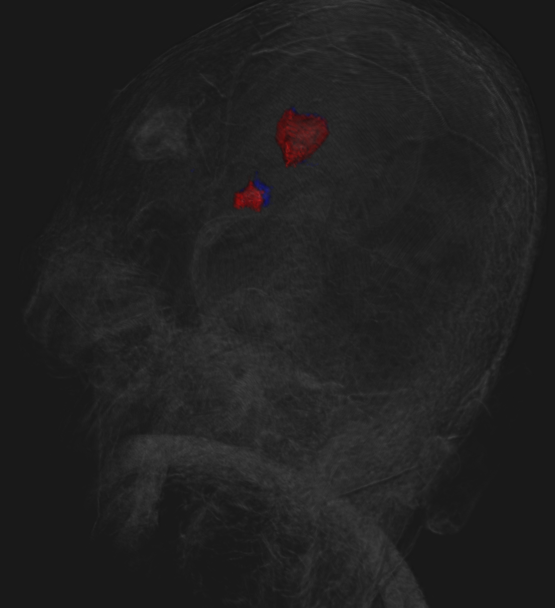

# vitk

## Membres   
XU Thomas - XU David - AKDOGAN Kévin Berkant  

## Projet

Le but est d'étudier l'évolution d'une tumeur chez un patient a deux instants distints.

## Choix techniques

### Recallage  

Nous avions bien compris la méthode de recalage par translation.
Dans la même optique que le TP, nous avons réutiliser cette méthode.

#### Before Recallage

#### After Recallage

### Segmentation

Les 2 morceaux de tumeurs étaient représenter par des valeurs d'hyper-intensité
sur les images; une manière de segmenter cela est via les thresholds.
Une première approche via un threshold simple est de garder les valeurs
supérieur à un seuil n'était pas suffisant sachant que les valeurs constituant
le crâne du patient étaient également élever.

L'approche retenue a été de segmenté les tumeurs sur chaque slices 2D 
constituant l'image 3D.
Les seeds ont été placer sur les images 2D qui possédaient une hyper-intensité
aux points: 
    p1 = (120, 188)
    p2 = (98, 175)
Les images 2D ne contenant pas la tumeur n'ont donc pas de seed.
La méthode est semi-automatique dans le cadre où les seeds sont placée par
l'utilisateur.

### Visualisation

Pour chaque image présent dans le dossier ressource, la couleur bleue représente
la tumeur segmentée sur la première image ("Data/case6_gre1.nrrd") et le bleu
représente celle sur la deuxième image 
("Data/case6_gre2.nrrd").

Le main.py n'affiche que le but final du projet qui est de visualiser la 
différence entre les deux tumeurs dans le temps.

On peut ainsi voir qu'en considérant que "Data/case6_gre2.nrrd" est l'image plus
tardif alors la tumeur a diminuer de taille dans le temps.
En effet la tumeur rouge est plus petite que la tumeur bleue.

Ici, nous avons choisi de réduire l'opacité de la tumeur rouge pour que nous
puissons observer les deux simultanément.

Pour se rendre compte que la tumeur rouge est plus grande que la bleue,
nous pouvons jouer avec les opacités des tumeurs.
Pour cela:

	fichier display.py:
 
	  fonction display_two_volumes:
	
  	    dans l'appel a la fonction create_volume, modifier le paramètre opacity

