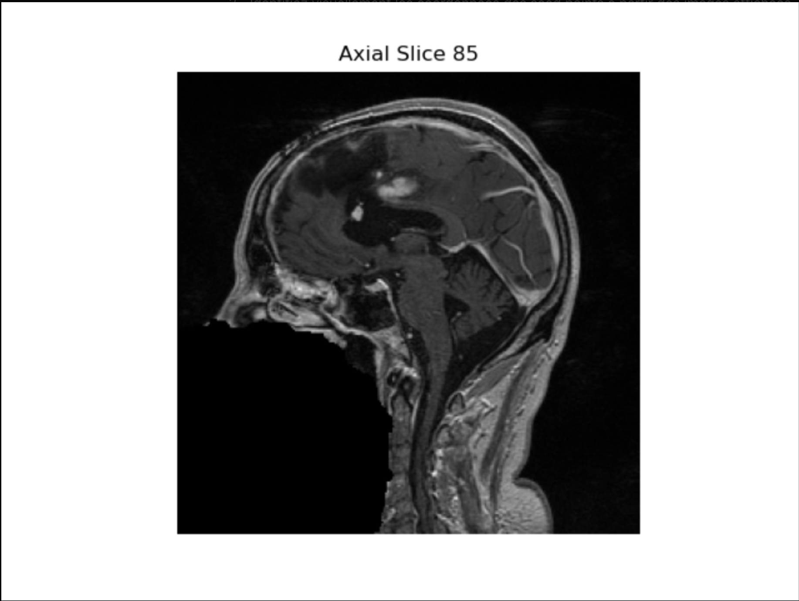

# vitk

## Membres   
XU Thomas - XU David - AKDOGAN Kévin Berkant  

## Projet

Le but est d'étudier l'évolution d'une tumeur chez un patient a deux instants distints.

## Choix techniques

### Recallage  

On a essayé la méthode du TP, elle a bien marché donc on est resté sur ca. On a essayé de changer les arguments mais on n'avait pas trop de différences.   

#### Before Recallage

#### After Recallage

### Segmentation

On voyait clairement que les 2 morceaux de tumeurs (non connexes) avaient des valeurs élevées, on a donc pensé a utiliser des thresholds.
La 1ere approche a été en utilisant les thresholds comme dans les TP mais il restait beaucoup de crane.

L'approche retenue a été de faire la segmentation sur chaque slide en 2d car on n'a pas réussi a le faire directement en 3d.  
On a donc utilisé le ConnectedThresholdImageFilter en placant des seeds dans les 2 morceaux de tumeurs a plusieurs endroits pour etre sur de les recuperer peu importe la slice sur laquelle on se trouve.

### Visualisation

//TODO
